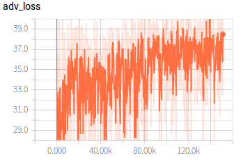
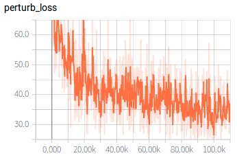
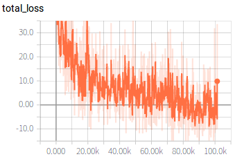
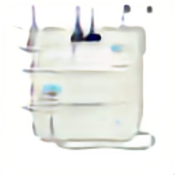
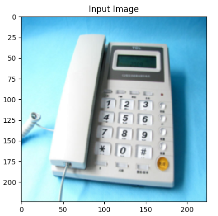
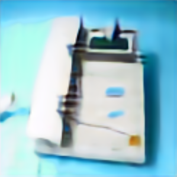
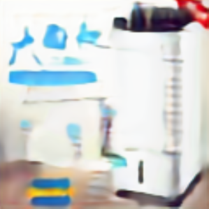

Attention-ATN
======
Tensorflow implementation of Attention-ATN: A Method to Generate Transferable Adversarial \\
Examples}

USAGE

Download the weight about defense model,cycle_gan model and based-model used to calculate cam-matrix from
[google clouds](https://drive.google.com/open?id=1bhQ43GSrG2JkiLgh4QedYPPrhgJd6rzG "x")

------
First run:

pip install -r requirements.txt

------
Next, run:

python train.py

After training some steps, the chenkpoints and attack images will be saved to local file holder.

The loss curve of training Attention-ATN:

Compare with raw images and adversarial Examples:

    

    

    

    

    

    

