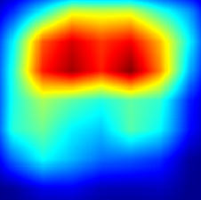
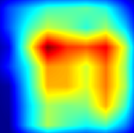

Attention-ATN
======
Tensorflow implementation of Attention-ATN: A Method to Generate Transferable Adversarial Examples}

USAGE

Download the weight about defense model,cycle_gan model and based-model used to calculate cam-matrix from
[google clouds](https://drive.google.com/drive/folders/1iYP53cRqVhfXXY_eYN-spWFrvhPFD67N "x")

Download the data sets:[AAAC-2019 data sets](https://tianchi.aliyun.com/competition/entrance/231701/information "x")
------
First run:

pip install -r requirements.txt

------
Next, run:

python train.py

After training some steps, the chenkpoints and attack images will be saved to local file holder.

The loss curve of training Attention-ATN:

Compare with raw images and adversarial examples:

<table>
    <tr>
        <td >
image1 
</td>
        <td >
Grad_cam1 
</td>
        <td >
adversarial example1 
</td>
    </tr>
</table>

<table>
    <tr>
        <td>
image2 
</td>
        <td >
Grad_cam2 
</td>
        <td >
adversarial example2 
 </td>
    </tr>
</table>

<table>
    <tr>
        <td>
image3 
</td>
        <td >
Grad_cam3 
</td>
        <td>
adversarial example3 
</td>
    </tr>

</table>

